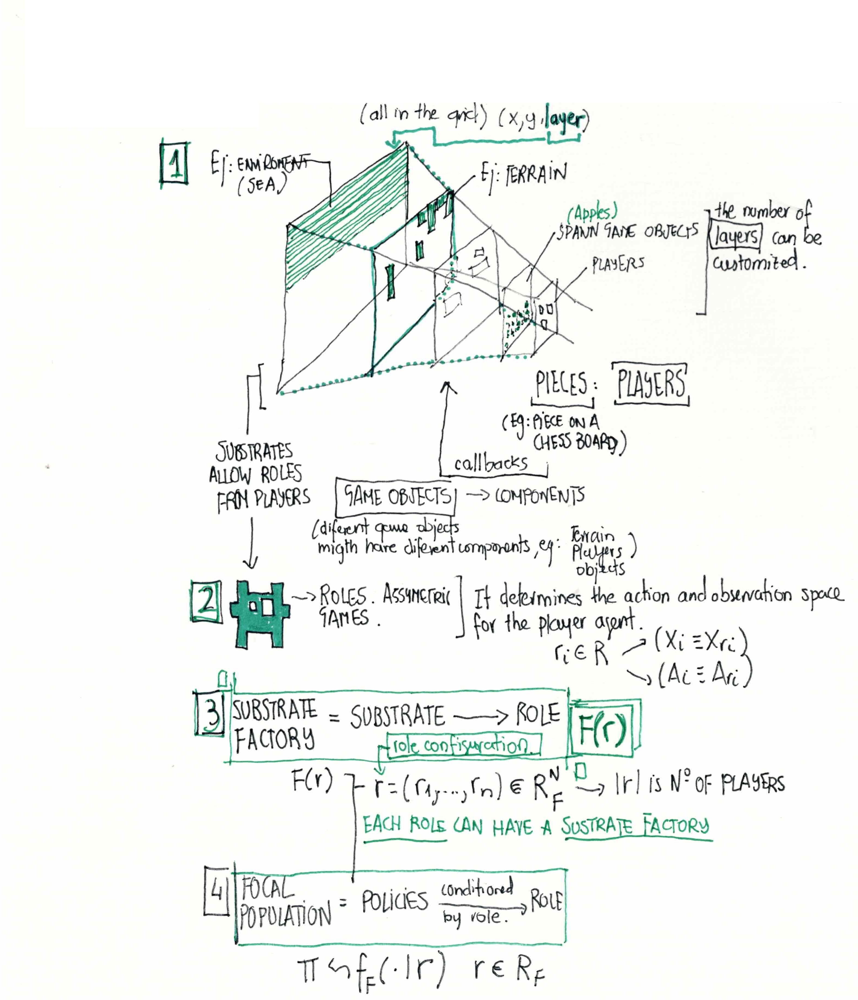

# MARL Melting Pot

Part of Alignment final project .
Currently under development. Find document about research [here](https://docs.google.com/document/d/1I0PSGQzjE7XYgp2RK7zeijA3fGBJ80TQMMMU-SMo7Uk/edit?usp=sharing)


>**NOTE:** This repository provides a basic startup code for training RLLIB agents on Melting Pot.
This repository comes from a fork from [this
one](https://github.com/rstrivedi/Melting-Pot-Contest-2023) used as a baseline,
with some introduced changes in substrates.


# Table of Contents

- [Concepts](#concepts)
- [Substrates and Scenarios](#substrates-and-scenarios)
- [Installation Guidelines](#installation-guidelines)
- [Run Training](#run-training)
- [Run Evaluation](#run-evaluation)
- [Code Structure](#code-structure)
- [How to Guide](#how-to-guide)
  - [Make submission](#make-submission)
  - [Visualization](#visualization)
  - [Logging](#logging)
- [Identified Issues with Ray 2.6.1](#identified-issues-with-ray-2.6.1)

## Concepts

This section aims to summarize some of the key concepts coming from the
[technical report](https://arxiv.org/pdf/2211.13746.pdf) 
The two main research questions that this framework poses are (1)
**how to train agents so that they develop social-cognitive abilities on par with
those of humans?**; and (2) **how to measure progress toward the goal evaluating
generalization?**.

It explores the general challenge of cooperation through some social-cognitive
dimensions (persuation and negotiation, reciprocity and reputational concern,
alliances and incentive alignment, imitation and teaching, leadership and
responsibilty, commitment and promises, trust and monitoring, sharing and
division of labor, social norms and institutions, and other social-cognitive
capacities)

Melting Pot 2.0 allows researchers to evaluate algorithms that train populations of agents
to behave socially. How will the resulting agents resolve social dilemmas? Can they deal with freeriders? Will they learn policies that have an equitable distribution of returns? Will the winner
take all? These questions not only present interesting research directions, but are also important
to consider in the context of AI safety and fairness. After all, human society is a multi-agent
system and any deployed AI agent will have to generalize to it.



Some key concepts include the following terminology:

1. *MAPLA*. Multi-agent population learning algorithm. Term refearing to any
   training process that produces a decentralized population of agents capable
   of simultaneous interaction with one another.


2. *Substrate*. N-player partially observable general-sum Markov game. All the
   substrates share some properties regarding movement *actions* (forward,
   backward, left, right, turn left, turn right), *observations* (in RGB pixels,
   the size of each observation is 88x88x3), *agents observability* (the agents
   have a partial observability window of 11x11 sprites) The agent sees 9 rows
   in front of itself, 1 row behind, and 5 columns to either side. A tutorial
   for creating substrates can be found
   [here](https://github.com/google-deepmind/meltingpot/blob/main/docs/substrate_tutorial/index.md)
   
3. *Role* . The player´s observation and action space may vary according to
   their role. Substrates have a set of allowed roles. the role determines the
   action and the observation space.

4. *Substrate factories* Sub-sustate defined by a role. Used to sample a
   substrate, allowing agents to be trained for a specific role supported by
   that substrate factory.

5. *Focal population* When we train the agent in a substrate factory, this
   results in a focal population. There is another concept of background
   population that is the set of RL agents.

## Substrates and Scenarios

For this contest, we will focus on following 4 substrates and we list the corresponding
validation scenarios that your submission will be evaluated on during development phase:

| Substrate | Scenarios |
| --------- | --------- |
| allelopathic_harvest__open | allelopathic_harvest__open_0 |
| | allelopathic_harvest__open_1 |
| | allelopathic_harvest__open_2 |
| clean_up | clean_up_2|
| | clean_up_3 |
| | clean_up_4 |
| | clean_up_5 |
| | clean_up_6 |
| | clean_up_7 |
| | clean_up_8 |
| prisoners_dilemma_in_the_matrix__arena | prisoners_dilemma_in_the_matrix__arena_0 |
| | prisoners_dilemma_in_the_matrix__arena_1 |
| | prisoners_dilemma_in_the_matrix__arena_2 |
| | prisoners_dilemma_in_the_matrix__arena_3 |
| | prisoners_dilemma_in_the_matrix__arena_4 |
| | prisoners_dilemma_in_the_matrix__arena_5 |
| territory__rooms | territory__rooms_0 |
| | territory__rooms_1 |
| | territory__rooms_2 |
| | territory__rooms_3 |

## Installation Guidelines

### MacOS Ventura 13.2.1 and Ubuntu 20.04 LTS

The baseline codes and accompanying MeltingPot installation has been tested on MacOS with support for x86_64 platform. If you use newer M1 chips, there may be additional steps required. You are welcome to post in discussion forums if you encounter any issues with installation.

It is recommended to use virtual environments as the setup requires specific versions for some libraries. Below, we provide installation with [Conda](https://conda.io/projects/conda/en/latest/user-guide/install/index.html#regular-installation) package manager.

```
git clone <this-repo>
cd <repo-home>
conda create -n mpc_main python=3.10
conda activate mpc_main
SYSTEM_VERSION_COMPAT=0 pip install dmlab2d
pip install -e .
sh ray_patch.sh
```

## Run Training

```
python baselines/train/run_ray_train.py [OPTIONS]
```
```
OPTIONS:
  -h, --help            show this help message and exit
  --num_workers NUM_WORKERS
                        Number of workers to use for sample collection. Setting it zero will use same worker for collection and model training.
  --num_gpus NUM_GPUS   Number of GPUs to run on (can be a fraction)
  --local               If enabled, init ray in local mode.
  --no-tune             If enabled, no hyper-parameter tuning.
  --algo {ppo}          Algorithm to train agents.
  --framework {tf,torch}
                        The DL framework specifier (tf2 eager is not supported).
  --exp {pd_arena,al_harvest,clean_up,territory_rooms}
                        Name of the substrate to run
  --seed SEED           Seed to run
  --results_dir RESULTS_DIR
                        Name of the wandb group
  --logging {DEBUG,INFO,WARN,ERROR}
                        The level of training and data flow messages to print.
  --wandb WANDB         Whether to use WanDB logging.
  --downsample DOWNSAMPLE
                        Whether to downsample substrates in MeltingPot. Defaults to 8.
  --as-test             Whether this script should be run as a test.

```

> For torch backend, you may need to prepend the above command with CUDA_VISIBLE_DEVICE=[DEVICE IDs]
if your algorithm does not seem to find GPU when enabled.

## Run Evaluation

```
python baselines/evaluation/evaluate.py [OPTIONS]
```

For running a first evaluation we need at least config_dir and policies_dir arguments

```
python baselines/evaluation/evaluate.py --config_dir /Users/../PPO_meltingpot_1a4b7_00000_0_2024-03-26_23-06-31 --policies_dir /Users/../PPO_meltingpot_1a4b7_00000_0_2024-03-26_23-06-31/checkpoint_000000/policies
```

```
OPTIONS:
  -h, --help            show this help message and exit
  --num_episodes NUM_EPISODES
                        Number of episodes to run evaluation
  --eval_on_scenario EVAL_ON_SCENARIO
                        Whether to evaluate on scenario. If this is False, evaluation is done on substrate
  --scenario SCENARIO   Name of the scenario. This cannot be None when eval_on_scenario is set to True.
  --config_dir CONFIG_DIR
                        Directory where your experiment config (params.json) is located
  --policies_dir POLICIES_DIR
                        Directory where your trained policies are located
  --create_videos CREATE_VIDEOS
                        Whether to create evaluation videos
  --video_dir VIDEO_DIR
                        Directory where you want to store evaluation videos
```
## Code Structure

```
.
├── meltingpot          # A forked version of meltingpot used to train and test the baselines
├── setup.py            # Contains all the information about dependencies required to be installed
└── baselines           # Baseline code to train RLLib agents
    ├── customs         # Add custom policies and metrics here
    |── evaluation      # Evaluate trained models on substrate and scenarios locally
    ├── models          # Add models not registered in Rllib here
    |── tests           # Unit tests to test environment and training
    ├── train           # All codes related to training baselines
      |__configs.py     # Modify model and policy configs in this file
    |── wrappers        # Example code to write wrappers around your environment for added functionality
```

## How to Guide


### Make Submission
---
The trained models will be available in the results folder configured by you.
Please refer to the guidelines on AICrowd [submision-starter-kit](https://gitlab.aicrowd.com/aicrowd/challenges/meltingpot-2023/meltingpot-2023-starter-kit) to make a
submission using the trained checkpoints.

### Visualization
---
#### How to render trained models?

```
python baselines/train/render_models.py [OPTIONS]
```
```
OPTIONS:
  -h, --help            show this help message and exit
  --config_dir CONFIG_DIR
                        Directory where your experiment config (params.json) is located
  --policies_dir POLICIES_DIR
                        Directory where your trained policies are located
  --horizon HORIZON     No. of environment timesteps to render models
```

#### How to visualize scenario plays?

You can also generate videos of agents behavior in various scenarios during local evaluation.
To do this, set `create_videos=True` and `video_dir='<PATH to video directory>'` while running evaluation.
If `eval_on_scenario=False`, this will create video plays of evaluation on substrate.

```
python baselines/evaluation/evaluate.py --create_videos=True --video_dir='' [OPTIONS]
```

**Note:** The script for generating these videos is located in `VideoSubject` class in `meltingpot/utils/evaluation/evaluation.py`. Modify this class to play with video properties such as codec, fps etc. or use different video writer. If you do not use meltingpot code from this repo, we have found that the generated videos are rendered very tiny. To fix that, add `rgb_frame = rgb_frame.repeat(scale, axis=0).repeat(scale, axis=1)` after `line 88` to extrapolate the image, where we used `scale=32`.   

### Logging
---
You can use either Wandb or Tensorboard to log and visualize your training landscape. The install setup provided includes support for both of them.

#### WanDB Logging

To setup Wandb:

1. wandb login
2. Get the API key from your account and set corresponding environment variable
   using in CLI `export WANDB_API_KEY=<Your Key>`
3. Enable Wandb logging during training using  `python run_ray_train.py --wandb=True`

#### Tensorboard Logging

To visualize your results with TensorBoard, run: `tensorboard --logdir <results_dir>`


## Identified issues with Ray 2.6.1

During our training, we found issues with both tf and torch backends that leads to errors when using default lstm wrapper provided by rllib. Our installation script above provides fix patches `ray_patch.sh` for the same. But if you use the manual installation approach, the following fixes need to be applied after installation:

*  For tf users:

In your Python library folder, in the file ray/rllib/policy/sample_batch.py, replace line 636 with the following snippet:

```python
time_lengths = tree.map_structure(lambda x: len(x), data[next(iter(data))])
flattened_lengths = tree.flatten(time_lengths)
assert all(t == flattened_lengths[0] for t in flattened_lengths)
data_len = flattened_lengths[0]
```

* For torch users:

In your Python library folder, in the file ray/rllib/models/torch/complex_input_net.py replace line 181 with:

```python
self.num_outputs = concat_size if not self.post_fc_stack else self.post_fc_stack.num_outputs
```
